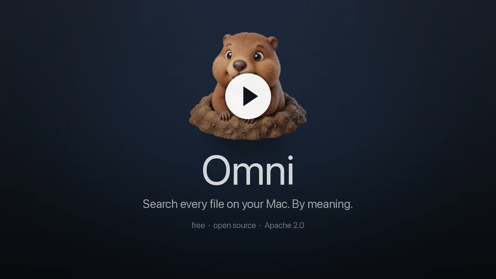

<p align="center">
  
</p>

<h1 align="center">Omni</h1>

<p align="center">Semantic search over your local files, running entirely on-device.</p>

<p align="center">
  <a href="https://hanxiao.io/omni"><b>Download for macOS &rarr;</b></a>
</p>

Omni indexes your files and lets you search them by meaning instead of filename. A
text query finds matching documents, code, PDFs, images, audio, and video together,
because everything is embedded into one shared vector space. The model runs in-process
on Apple GPUs via a native MLX-Swift port of `jina-embeddings-v5-omni`, in two sizes -
[Nano](https://huggingface.co/jinaai/jina-embeddings-v5-omni-nano-mlx) (~1.9 GB) and
[Small](https://huggingface.co/jinaai/jina-embeddings-v5-omni-small-mlx) (~3.1 GB). No
Python, no server, no cloud: the model downloads once, then indexing and search run with
no network at all. Airgap the Mac and Omni keeps working.

<p align="center">
  <a href="https://hanxiao.io/omni/assets/omni-intro.mp4" title="Watch the Omni demo (37 seconds)">
    
  </a>
  <br>
  <a href="https://hanxiao.io/omni/assets/omni-intro.mp4"><b>&#9654;&#65039; Watch the 37-second demo</b></a>
</p>

## Install

Download the latest DMG from [**hanxiao.io/omni**](https://hanxiao.io/omni) (or from
[GitHub Releases](https://github.com/hanxiao/omni-macos/releases)), open it, and drag
**Omni** onto **Applications**. Builds are notarized, so they open without a Gatekeeper prompt.

On first launch Omni downloads the model once (Nano ~1.9 GB or Small ~3.1 GB). That is the
only time it touches the network: after that, both indexing and search run on-device with
nothing leaving your Mac, so you can pull the plug and run it fully airgapped. Point it at
folders to index (Documents, Downloads, Desktop, or any folder you pick), press Index, then search.

Requires an Apple silicon Mac on macOS 14 or later.

## Build from source

```
brew install xcodegen
export OMNI_TEAM_ID=XXXXXXXXXX   # your 10-char Apple Team ID (see below)
xcodegen generate
open Omni.xcodeproj              # then Cmd+R
```

You need:

- **Apple silicon Mac, macOS 14+.**
- **Xcode 26 with the Metal Toolchain** (`xcodebuild -downloadComponent MetalToolchain`).
  MLX-Swift compiles Metal shaders; a plain SwiftPM command-line build cannot, so build
  through Xcode or `xcodebuild`.
- **The model directory** (`model.safetensors`, `tokenizer.json`, `config.json`,
  `adapters/retrieval/`) from
  [`jinaai/jina-embeddings-v5-omni-small-mlx`](https://huggingface.co/jinaai/jina-embeddings-v5-omni-small-mlx)
  (or the `-nano-` variant). The app finds it via `$OMNI_MODEL_DIR`,
  `~/Library/Application Support/Omni/`, or the HuggingFace cache, and otherwise asks
  you to pick the folder.

### Why an Apple Developer account is needed

Omni reads files in your Documents, Downloads, and Desktop, which macOS gates behind
TCC permission. The app is code-signed (not ad-hoc) so the system ties that permission
to a stable signature and remembers your grant across rebuilds instead of re-prompting
every time. Signing requires a Team ID, which is why `OMNI_TEAM_ID` is set above.

- **Build and run locally:** a **free** Apple ID is enough. Add it in Xcode (Settings -
  Accounts), use the personal team it creates, and put that team's ID in `OMNI_TEAM_ID`.
- **Distribute a notarized DMG** like the Releases here: this needs the **paid Apple
  Developer Program** ($99/yr) for a *Developer ID Application* certificate and Apple's
  notary service. The release pipeline (`.github/workflows/release.yml`) uses it; you
  don't need it just to run Omni yourself.

The repository contains no Apple credentials. The Team ID comes from `OMNI_TEAM_ID`
locally and from the `APPLE_TEAM_ID` GitHub secret in CI; the signing certificate,
notary password, and deploy tokens are all GitHub Actions secrets.

## Verify the engine

The MLX-Swift encoder is checked numerically against Python reference fixtures: text
must match to cosine >= 0.999 with identical token ids; image, video, and audio towers
match the upstream `model.py` to cosine ~1.0 on identical preprocessed inputs.

```
uv run python Tools/gen_fixtures.py          # regenerate fixtures (needs mlx + tokenizers)
cp -R <model snapshot> /private/tmp/omni-model
make test                                    # compiles shaders, asserts the cosines
```

## Architecture

```
Sources/OmniKit/   engine + indexer (SPM library)
App/               SwiftUI macOS app (project.yml -> Omni.xcodeproj via XcodeGen)
Tools/             reference fixture generator
Tests/             numeric parity + end-to-end search tests
```

### Embedding

`jina-embeddings-v5-omni` ported to MLX-Swift: a Qwen3 text tower, a Qwen3-VL vision
tower (also used for video frames and scanned-PDF pages), and a Whisper-style audio
tower. `WeightStore` loads the HF safetensors and merges the retrieval LoRA into the
backbone; encoders pool the last token and L2-normalize. All modalities land in one
shared space, so text finds images and audio finds text.

This is not a stock checkpoint runner. The towers are reworked for throughput - fused
norm/activation/rope kernels, fused bias matmuls, shape-aware compile policy, tuned
attention I/O precision, cross-file GPU batching with double-buffered readout - while
staying parity-gated against the Python reference (cosine >= 0.999, exact token match).
Expect the same vectors as the original model, not the same speed.

### Indexing

Crawl -> extract -> chunk -> embed -> store, incremental by file mtime and size. A
concurrent decode stage (text extraction, image patchify, audio mel) feeds one
serialized GPU embed stage; text chunks and images batch across files, audio batches
clips under a frame budget. Live updates from the file watcher go through the same
batched path as a full pass. MLX calls are serialized through a priority gate and the
batch size adapts while you type, so search stays responsive during indexing.

### Storing

SQLite is the durable store: file metadata plus bf16 vectors (2 bytes per dimension,
negligible recall loss on normalized embeddings). The resident form adapts to the
memory budget in Settings > Performance: a full bf16 matrix when it fits, and past
that a 4-bit quantized scan replica with the exact bf16 copy kept in a file-backed
mapping the OS can page out. Old indexes load unchanged in either mode.

### Search

Exact cosine when the index fits the budget: one GPU matmul of the query against the
resident matrix (a base prefix plus a small delta of recent rows, scored in one
evaluation). At scale, a two-stage funnel: a coarse scan over the quantized replica
selects top candidates on the GPU, which are rescored exactly in bf16 before ranking -
final scores are exact either way, and recall is gated against the full-precision
baseline. Results reduce to the best chunk per file, filtered by kind, folder,
extension, and recency. Idle search is a few milliseconds.

## License

[Apache 2.0](LICENSE). The model weights are covered by the upstream Jina license
(CC-BY-NC-4.0), not this repository.
