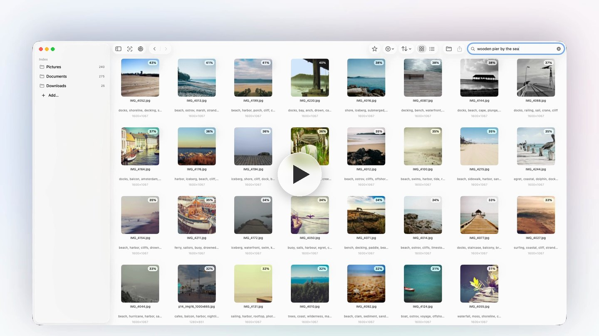

<p align="center">
  
</p>

<h1 align="center">Omni</h1>

<p align="center">Search every file on your Mac by meaning. On device.</p>

<p align="center">
  <a href="https://hanxiao.io/omni"><b>Download</b></a>
  &nbsp;&middot;&nbsp;
  <a href="https://arxiv.org/abs/2608.05543"><b>Technical report</b></a>
</p>

<p align="center">
  <a href="https://hanxiao.io/omni/assets/omni-intro.mp4">
    
  </a>
</p>

Text, code, PDFs, images, audio and video in one vector space, so any query finds any kind of
file. The embedding model is `jina-embeddings-v5-omni`, ported to MLX-Swift and running
in-process on the GPU. No Python, no server, no cloud.

It browses like Finder, runs on Metal, keeps up as files change, and works with the network
cable pulled.

## Install

Download the DMG from [hanxiao.io/omni](https://hanxiao.io/omni) or
[Releases](https://github.com/hanxiao/omni-macos/releases) and drag Omni to Applications.

On first launch Omni downloads its search model (1.8 GB), and optionally the OCR model (4.2 GB)
for transcribing scans and photos. After that nothing leaves the Mac.

## Serving

Settings > Serving exposes an HTTP API on `127.0.0.1:51234` with an MCP endpoint at `/mcp`.

```bash
curl -sX POST localhost:51234/v1/search -d '{"query": "invoice from march"}'
curl -sX POST localhost:51234/v1/sources/add -d '{"path": "~/Projects"}'
```

## Build

```bash
brew install xcodegen
export OMNI_TEAM_ID=XXXXXXXXXX   # your Apple Team ID; a free account works for local builds
./Scripts/build-app.sh           # not a bare xcodebuild: see the script's header
```

Needs Xcode 26 with the Metal Toolchain. The app downloads its models itself; `OMNI_MODEL_DIR`
points it at a local copy instead. `make test` runs the suite, including numeric parity with Python reference
fixtures.

## Citation

```bibtex
@article{xiao2026omnimacos,
  title   = {omni-macos: On-Device Omni-Modal Search on Apple Silicon},
  author  = {Xiao, Han},
  journal = {arXiv preprint arXiv:2608.05543},
  year    = {2026},
  url     = {https://arxiv.org/abs/2608.05543}
}
```

## License

[Apache 2.0](LICENSE). Model weights are under the upstream Jina license (CC-BY-NC-4.0).
